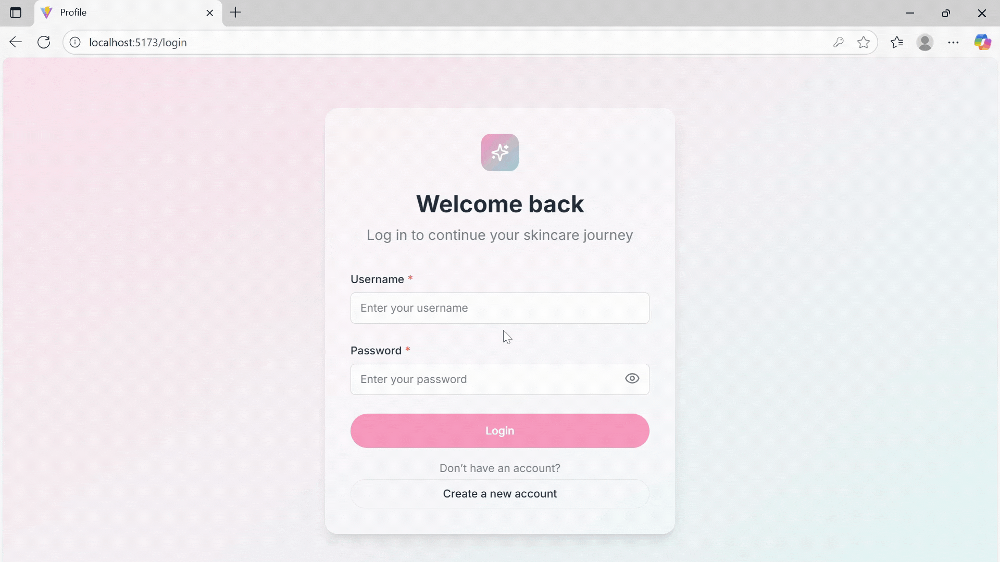

# 🧴 SkinCare Analyzer - AI-Powered Cosmetic Safety Intelligence Platform

[](https://opensource.org/licenses/MIT)
[](https://reactjs.org/)
[](https://nodejs.org/)
[](https://www.mongodb.com/)

> **Naver Vietnam AI Hackathon 2025 Submission**  
> An intelligent cosmetic product analyzer that leverages Naver Cloud Platform's AI services to help users make informed decisions about skincare products through ingredient analysis, personalized recommendations, and AI-powered consultations.

<p align="center">
  
</p>
<p align="center"><i>See SkinCare Analyzer in action: instant product analysis, routine recommendations, and AI consultation—all in one platform.</i></p>

---

## 📋 Table of Contents

- [Overview](#-overview)
- [Key Features](#-key-features)
- [Technology Stack](#-technology-stack)
- [Architecture](#-architecture)
- [Naver AI Integration](#-naver-ai-integration)
- [Installation](#-installation)
- [Usage](#-usage)
- [API Documentation](#-api-documentation)
- [Project Structure](#-project-structure)
- [Screenshots](#-screenshots)
- [Future Enhancements](#-future-enhancements)
- [Contributing](#-contributing)
- [License](#-license)

---

## 🌟 Overview

**SkinCare Analyzer** is a comprehensive web application that empowers consumers to make safer, more informed cosmetic product choices. Using advanced AI and machine learning technologies from Naver Cloud Platform, the application provides:

- **Instant Product Analysis**: Upload product images to extract and analyze ingredient lists using OCR technology
- **Risk Assessment**: Real-time ingredient safety evaluation with detailed risk categorization
- **Personalized Recommendations**: Custom skincare routines based on skin type, concerns, and environmental factors
- **AI Consultation**: Interactive chatbot for skincare advice and product recommendations
- **Historical Tracking**: Save and review past product scans and skincare routines

The platform addresses the growing consumer demand for transparency in cosmetic products, helping users avoid potentially harmful ingredients and find products that truly match their needs.

---

## ✨ Key Features

### 🔍 **Product Analysis**

- **Image-Based OCR**: Upload front and back images of cosmetic products
- **Intelligent Ingredient Extraction**: Automatically detect and extract ingredient lists from product labels
- **Comprehensive Risk Assessment**: Categorize ingredients into four risk levels:
  - ✅ **No Risk**: Safe, FDA-approved ingredients
  - 🟢 **Low Risk**: Generally safe with minimal side effects
  - 🟡 **Moderate Risk**: May cause sensitivity or require precautions
  - 🔴 **High Risk**: Potentially harmful or restricted ingredients
- **Ingredient Database**: Cross-reference with 28,000+ cosmetic ingredients from CosIng database
- **Product Information Extraction**: Automatically identify product name, brand, and category
- **Skin Compatibility Score**: Personalized suitability assessment based on user's skin type and skin concerns
- **Ingredient Benefits Analysis**: Detailed breakdown of each ingredient's benefits (hydration, anti-aging, brightening, etc.)
- **Skin Type Matching**: Evaluate which skin types each ingredient is suitable for (oily, dry, combination, sensitive)

### 💬 **AI Skincare Chatbot**

- **Natural Language Processing**: Powered by Naver Clova Chatbot API
- **Personalized Consultation**: Get advice based on your skin type and concerns
- **Product Recommendations**: Receive suggestions tailored to your needs
- **24/7 Availability**: Instant responses to skincare questions

### 📊 **Personalized Routine Recommendations**

- **Smart Algorithm**: Multi-factor analysis combining:
  - Skin type compatibility (oily, dry, combination, normal, sensitive)
  - Weather conditions (UV index)
  - Specific skin concerns (acne, aging, pigmentation, etc.)
- **Weather Integration**: Real-time weather data to adjust recommendations
- **Curated Product Database**: Access to 1,400+ verified skincare products and 150+ pre-built routines
- **Budget-Based Filtering**: Three price ranges (budget-friendly, mid-range, premium) to match user spending preferences
- **Step-by-Step Routines**: Multiple routine types including minimal (3-5 steps), complete (7-10 steps), focus treatment, hydration, and anti-aging
- **Business Value**: Product recommendation engine drives e-commerce potential and affiliate partnerships

### 📱 **User Experience**

- **Scan History**: Track all analyzed products with timestamps
- **Saved Routines**: Bookmark and manage personalized skincare regimens
- **User Profiles**: Manage skin type, concerns, and preferences
- **Responsive Design**: Seamless experience across desktop and mobile devices
- **Progressive Web App**: Fast loading with modern UI/UX

---

## 🛠 Technology Stack

### **Frontend**

- **Framework**: React 18.2 with Vite
- **Styling**: Tailwind CSS with custom design system
- **State Management**: Redux Toolkit
- **Routing**: React Router v6
- **UI Components**:
  - Radix UI for accessible primitives
  - Framer Motion for animations
  - Lucide React for icons
- **Data Visualization**: Recharts, D3.js
- **Form Handling**: React Hook Form

### **Backend**

- **Runtime**: Node.js (ES Modules)
- **Framework**: Express.js 5
- **Database**: MongoDB with Mongoose ODM
- **Authentication**: Session-based authentication
- **File Upload**: Multer for image handling
- **Security**:
  - Helmet for HTTP headers
  - CORS configuration
  - Rate limiting
- **Utilities**:
  - Axios for HTTP requests
  - Fuzzball for fuzzy string matching
  - CSV parsing for data import

### **Naver Cloud Platform AI Services**

- **CLOVA OCR**: Text extraction from product images
- **CLOVA Chatbot**: Natural language conversation
- **HyperCLOVA**: Advanced NLP for content generation

### **Third-Party APIs**

- **Open-Meteo**: Weather data for personalized recommendations
- **CosIng Database**: EU cosmetic ingredient database

---

## 🏗 Architecture

<p align="center">
  
</p>

### **Data Flow: Product Analysis**

```
1. User uploads product images (front + back)
2. Frontend sends images to /api/images/analyze
3. Backend triggers OCR service (Naver CLOVA OCR)
4. Extract ingredients from OCR text
5. Match ingredients with CosIng database (fuzzy matching)
6. Enrich ingredient data with safety information
7. Analyze risks and categorize ingredients
8. Generate product summary with HyperCLOVA
9. Return comprehensive analysis to frontend
10. Save to scan history
```

---

## 🔗 Naver AI Integration

### **1. CLOVA OCR (Optical Character Recognition)**

**Purpose**: Extract text from product images to identify ingredients

**Implementation**:

```javascript
// backend/src/services/ocr.service.js
const message = {
  version: "V2",
  requestId: `${Date.now()}`,
  timestamp: Date.now(),
  images: [
    {
      format: imageFormat,
      name: path.basename(imagePath),
      data: null,
      url: null,
    },
  ],
  lang: lang,
  resultType: "json",
};

const response = await axios({
  method: "post",
  url: apiUrl,
  headers: { "X-OCR-SECRET": secretKey, ...form.getHeaders() },
  data: form,
  maxBodyLength: Infinity,
  maxContentLength: Infinity,
  timeout: 60000, // 60 second timeout for OCR calls
});
return response.data;
```

**Features Used**:

- General OCR for text extraction
- Multi-language support (English, Korean)
- High accuracy for small text on product labels
- Confidence scoring for extracted text

**Value Added**:

- Eliminates manual ingredient list entry
- Handles various label formats and orientations
- Processes both front (product name) and back (ingredients) images
- Supports batch processing for multiple products

---

### **2. CLOVA Chatbot**

**Purpose**: Provide interactive skincare consultation and product advice

**Implementation**:

```javascript
// backend/src/services/clovaChatbot.service.js
export default class ClovaChatbot {
  async sendText(message, userId) {
    const payload = {
      version: "v2",
      userId,
      bubbles: [{ type: "text", data: { description: message } }],
      event: "send",
    };
    return this.request(payload);
  }
}
```

**Features Used**:

- Natural language understanding
- Context-aware responses
- Custom scenario builder integration
- Multi-turn conversations
- Postback actions for structured responses

**Value Added**:

- 24/7 skincare expert consultation
- Personalized product recommendations
- Answers to ingredient-specific questions
- Guidance on routine building

---

### **3. HyperCLOVA (Advanced NLP)**

**Purpose**: Generate intelligent summaries and content analysis

**Implementation**:

```javascript
const response = await axios.post(
  process.env.HYPER_CLOVA_API_URL,
  {
    messages: [
      {
        role: "system",
        content:
          "You are a skincare ingredient expert. Provide accurate, concise information in JSON format.",
      },
      {
        role: "user",
        content: prompt,
      },
    ],
    response_format: { type: "json_object" },
    maxTokens: 1500,
    temperature: 0.3,
    topP: 0.8,
    repeatPenalty: 1.2,
  },
  {
    headers: {
      Authorization: `Bearer ${process.env.HYPER_CLOVA_API_KEY}`,
      "Content-Type": "application/json",
    },
    timeout: 60000, // 60 second timeout per LLM call
  }
);
```

**Features Used**:

- Text generation with context
- Summarization of complex ingredient data
- Natural language content creation
- Korean and English language support

**Value Added**:

- Automated benefit descriptions for routines
- User-friendly explanations of technical ingredient data
- Engaging product narratives
- Multilingual content support

---

## 📥 Installation

### **Prerequisites**

- Node.js 20.x or higher
- MongoDB 8.x or higher
- Naver Cloud Platform account with:
  - CLOVA OCR API credentials
  - CLOVA Chatbot API credentials
  - HyperCLOVA API credentials (optional)

### **1. Clone Repository**

```bash
git clone https://github.com/hbnnnnnnn/naver-vietnam-ai-hackathon.git
cd naver-vietnam-ai-hackathon
```

### **2. Backend Setup**

```bash
cd backend

# Install dependencies
npm install

# Create .env file
cat > .env << EOL
# Server Configuration
PORT=5731
NODE_ENV=development

# MongoDB
MONGODB_URI=mongodb://localhost:27017/skincare-analyzer

# Naver Cloud Platform
NAVER_OCR_SECRET_KEY=your_ocr_secret_key
NAVER_OCR_API_URL=your_ocr_api_url
NAVER_CHATBOT_SECRET_KEY=your_chatbot_secret_key
NAVER_CHATBOT_INVOKE_URL=your_chatbot_invoke_url
NAVER_HYPERCLOVA_API_KEY=your_hyperclova_key
NAVER_HYPERCLOVA_API_GATEWAY=your_hyperclova_gateway
NAVER_HYPERCLOVA_REQUEST_ID=your_request_id

# Open-Meteo API (no key required)
WEATHER_API_URL=https://api.open-meteo.com/v1/forecast

# File Upload
UPLOAD_DIR=./uploads
MAX_FILE_SIZE=10485760
EOL

# Seed initial data (optional)
node seedProduct.js
node seedRoutine.js

# Start backend server
npm run dev
```

### **3. Frontend Setup**

```bash
cd ../frontend

# Install dependencies
npm install

# Create .env file
cat > .env << EOL
VITE_API_BASE_URL=http://localhost:5731/api
VITE_USE_REAL_API=true
EOL

# Start frontend development server
npm run dev
```

### **4. Access Application**

- **Frontend**: http://localhost:5173
- **Backend**: http://localhost:5731
- **MongoDB**: mongodb://localhost:27017

---

## 🚀 Usage

### **Product Analysis Workflow**

1. **Navigate** to Product Analysis page
2. **Upload** front and back product images
3. **Click** "Analyze Product"
4. **Review** extracted ingredients and risk assessment

### **Get Routine Recommendations**

1. **Go to** Routine Recommendations page
2. **Choose** routine type and price range
3. **Click** "Get Routine Suggestions"
4. **Review** personalized product suggestions
5. **Save** routines you like

### **Chat with AI Consultant**

1. **Open** Chatbot page
2. **Type** your skincare question
3. **Receive** instant AI-powered advice

### **Manage Profile**

1. **Access** User Profile
2. **Update** skin type and concerns
3. **View** saved routines and scan history
4. **Track** your skincare journey

---

## 📚 API Documentation

### **Product Analysis**

```http
POST /api/images/analyze
Content-Type: multipart/form-data

Parameters:
- frontImage: File (required)
- backImage: File (required)

Response:
{
  "product": {
    "name": "Product Name",
    "brand": "Brand Name",
    "category": "Category"
  },
  "ingredients": [
    {
      "name": "Ingredient Name",
      "riskLevel": "low",
      "purpose": "Moisturizer",
      "concerns": []
    }
  ],
  "riskScore": 25,
  "safetyLevel": "safe"
}
```

### **Routine Recommendations**

```http
POST /api/routines/recommend
Content-Type: application/json

Body:
{
  "skinType": "combination",
  "concerns": ["acne", "aging"],
  "weather": {
    "temperature": 25,
    "humidity": 70
  }
}

Response:
{
  "routine": [
    {
      "product": { /* product details */ },
      "step": 1,
      "category": "cleanser"
    }
  ],
  "benefits": "AI-generated routine benefits"
}
```

### **Chatbot**

```http
POST /api/chatbot/send
Content-Type: application/json

Body:
{
  "message": "What's good for acne?",
  "userId": "user123"
}

Response:
{
  "response": "For acne-prone skin, I recommend...",
  "suggestions": ["Product A", "Product B"]
}
```

---

## 📁 Project Structure

```
skincare-analyzer/
├── frontend/
│   ├── src/
│   │   ├── components/
│   │   │   ├── ui/              # Reusable UI components
│   │   │   └── ErrorBoundary.jsx
│   │   ├── pages/
│   │   │   ├── landing-page/
│   │   │   ├── product-analysis/
│   │   │   ├── routine-recommendations/
│   │   │   ├── chatbot/
│   │   │   ├── user-profile/
│   │   │   └── login/
│   │   ├── services/
│   │   │   ├── api.js
│   │   │   ├── scanHistory.js
│   │   │   └── routine.js
│   │   ├── utils/
│   │   ├── Routes.jsx
│   │   └── App.jsx
│   ├── public/
│   └── package.json
│
├── backend/
│   ├── src/
│   │   ├── controllers/
│   │   │   ├── product.controller.js
│   │   │   ├── user.controller.js
│   │   │   ├── routine.controller.js
│   │   │   ├── ingredient.controller.js
│   │   │   └── image.controller.js
│   │   ├── models/
│   │   │   ├── Product.js
│   │   │   ├── User.js
│   │   │   ├── SavedRoutine.js
│   │   │   ├── ScanHistory.js
│   │   │   └── ingredientCosing.js
│   │   ├── routes/
│   │   │   ├── product.route.js
│   │   │   ├── user.route.js
│   │   │   ├── routine.route.js
│   │   │   ├── ingredient.route.js
│   │   │   ├── image.route.js
│   │   │   ├── chatbot.route.js
│   │   │   └── weather.route.js
│   │   ├── services/
│   │   │   ├── ocr.service.js
│   │   │   ├── clovaChatbot.service.js
│   │   │   ├── productInfoExtract.service.js
│   │   │   ├── ingredientExtract.service.js
│   │   │   ├── ingredientEnrichment.service.js
│   │   │   ├── calcSuitableScore.service.js
│   │   │   ├── benefitSummarization.service.js
│   │   │   ├── routine.service.js
│   │   │   └── weather.service.js
│   │   ├── utils/
│   │   │   ├── ocrLogic.js
│   │   │   └── dataParser.js
│   │   ├── config/
│   │   ├── middlewares/
│   │   └── server.js
│   ├── uploads/              # Uploaded images
│   ├── seedData/             # Initial data
│   └── package.json
│
├── README.md
├── INTEGRATION_GUIDE.md
└── package.json
```

---

## 🖼️ Demo Gallery

### Login & Sign Up

<p align="center">
  
</p>

<p align="center">
  
</p>

_Sign up or log in to save your analysis and routines_

### Product Analysis

<p align="center">
  
</p>

_Upload product images and get instant ingredient analysis with risk assessment_

### Routine Recommendations

<p align="center">
  
</p>

_Personalized skincare routines based on your skin type, budget, steps and environmental factors_

### AI Chatbot

<p align="center">
  
</p>

_24/7 skincare consultation powered by Naver CLOVA_

### Tracking History

<p align="center">
  
</p>

_Users can view their scan history and recommended routines. Every product scan and routine suggestion is saved for easy review and progress tracking._

---

## 🔮 Future Enhancements

### **Phase 1: Enhanced Analysis**

- [ ] Batch product comparison
- [ ] Ingredient interaction warnings
- [ ] Personalized allergen detection
- [ ] Multi-language support (Vietnamese,...)

### **Phase 2: Social Features**

- [ ] Product reviews and ratings
- [ ] Community-driven ingredient database
- [ ] Skincare routine sharing
- [ ] Expert dermatologist Q&A
- [ ] Comment and discussion forums

### **Phase 3: Advanced AI**

- [ ] Computer vision for product categorization
- [ ] Predictive skin condition tracking
- [ ] AR-based virtual product testing
- [ ] Recommend products based on scan history

### **Phase 4: E-commerce Integration**

- [ ] Price comparison across retailers
- [ ] Direct purchase links
- [ ] Subscription box recommendations
- [ ] Loyalty rewards program

---

## 🤝 Contributing

We welcome contributions from the community! Please follow these steps:

1. Fork the repository
2. Create a feature branch (`git checkout -b feature/AmazingFeature`)
3. Commit your changes (`git commit -m 'Add some AmazingFeature'`)
4. Push to the branch (`git push origin feature/AmazingFeature`)
5. Open a Pull Request

Please read [INTEGRATION_GUIDE.md](INTEGRATION_GUIDE.md) for detailed development guidelines.

---

## 📄 License

This project is licensed under the MIT License - see the [LICENSE](LICENSE) file for details.

---

## 👥 Team

**Naver Vietnam AI Hackathon 2025**

- Tran Cam Huy
- Ha Bao Ngoc
- Huynh Yen Nhi
- Nguyen Doan Xuan Thu

**Tunigochy** team with students from University of Science, VNU-HCM

---

## 🙏 Acknowledgments

- **Naver Cloud Platform** for providing powerful AI services
- **CosIng Database** (European Commission) for ingredient data
- **Open-Meteo** for weather API
- **React Community** for amazing libraries and tools

---

## 📞 Contact

For questions or support, please reach out:

- **Email**: tunigochy@gmail.com
- **GitHub Issues**: [Project Issues](https://github.com/hbnnnnnnn/naver-vietnam-ai-hackathon/issues)
- **Demo**: [Live Demo](https://github.com/hbnnnnnnn/naver-vietnam-ai-hackathon)

---

<div align="center">

**Made with ❤️ for Naver Vietnam AI Hackathon 2025**

[⬆ Back to Top](#-skincare-analyzer---ai-powered-cosmetic-safety-intelligence-platform)

</div>
# Auto-deploy test
